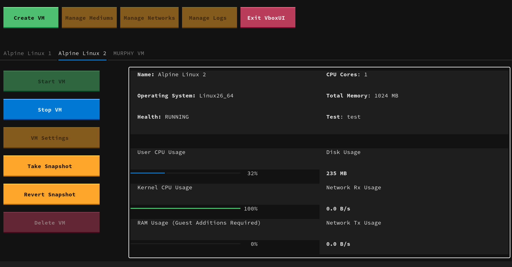

# VBoxUI



## Available Functionality

### Using VBoxUI, anyone can:

 - View existing VMs
 - View a VM's CPU count, maximum memory, operating system, and health
 - View live data regarding CPU usage, memory usage, and total storage used
 - Start / Stop / Delete existing VMs
 - Create new VMs from ISO files
    - Specify a name and OS Type
    - Specify number to CPU cores and maximum memory
    - Specify the amount of storage for the new attached medium
 - Take online and offline Snapshots of VMs
 - Revert a VM to a previous snapshot

### Upcoming features:

 - View and modify all VM settings
 - View and manage mediums
 - View and manage networks
 - Enable VM teleportation
 - VM log viewer

## How to install:

In order to install vboxui, you'll need python3.12 and pipx installed based on python3.12.

Download the vboxui repository:

```bash
git clone https://github.com/Zwork101/vboxui.git
```

Then install the application:

```bash
python3.12 -m pipx install .
```

Once installed, you can use the application in whatever directory, as long as you have write permissions there.

```bash
vboxui
```

## Enjoy! When logging in, use your account password.


### Known bugs:
 - Metrics won't reset to 0 when a VM is stopped
